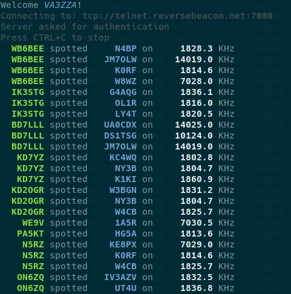

# Reverse Beacon Network CLI 
[](https://crates.io/crates/rbn) 

`rbn` is a small CLI interface to the [Reverse Beacon Network](https://reversebeacon.net), displaying all global network spots in real time as a formatted feed in a terminal.

## Installation

### From Source

```sh
git clone https://github.com/Ewpratten/rbn
cd rbn
cargo install --path .
```

### From Crates.io

```sh
cargo install rbn
```

### Pre-built Binaries

I share a few pre-built binaries for systems I use on the [releases](https://github.com/Ewpratten/rbn/releases/latest) page.

## Screenshots


